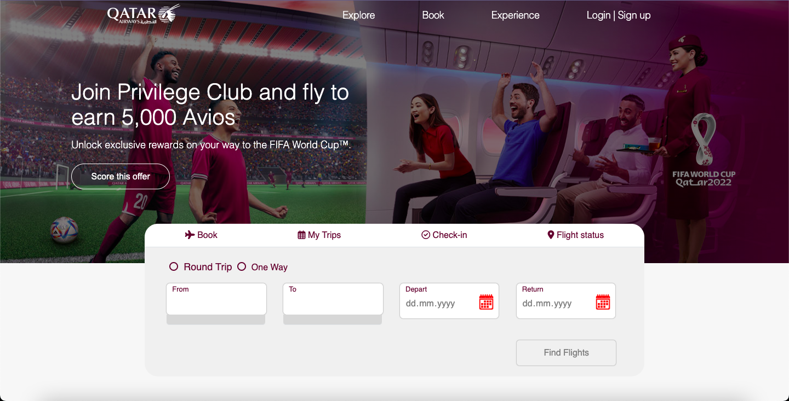
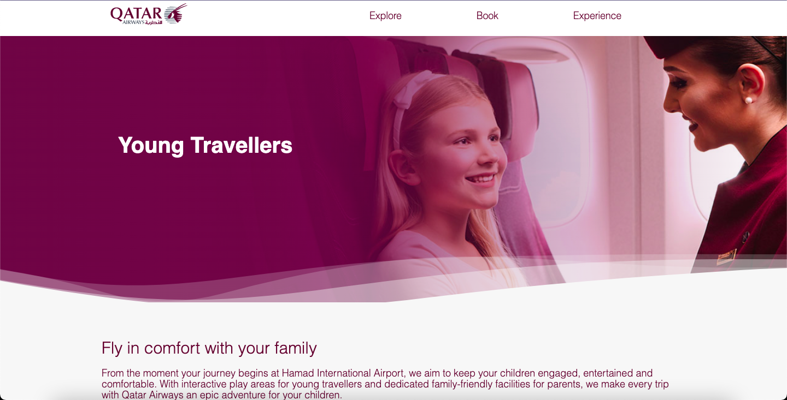

# Qatar-airways
Airline Reservation System contain airline schedules with detailed information. Users access an airline’s inventory after authorization. 
It contains all offered flights for a particular city-pair with price for different booking classes.  
  Based on the [Qatar Airways](https://www.qatarairways.com/en/homepage.html)

## Business rules
- The user can choose date of departure and return. The system should validate these dates. For instance, the return date should not be earlier that the departure date.
- In DB was stored different types of carries with different dates.
- Button ‘One way’ within booking process.
- Online payment + card validity + timer.
- Price policy. More expensive price during the day, cheaper at night.
- Registration & login.

## Main pages

